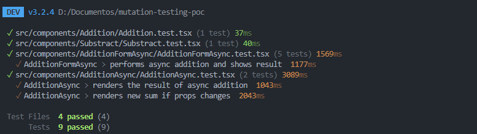
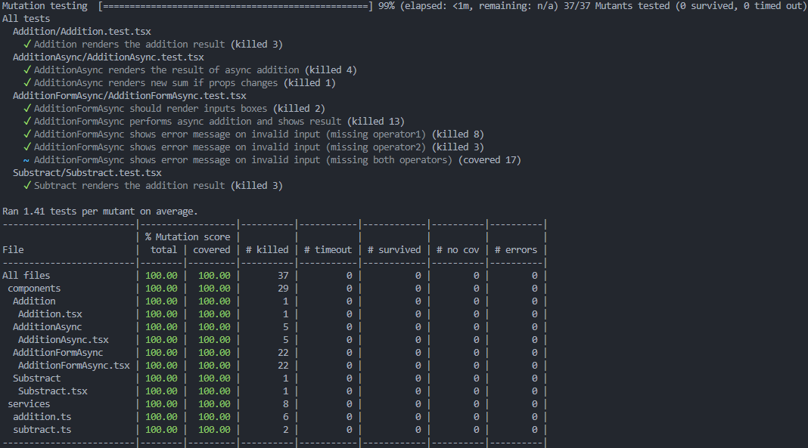

# Mutation Testing

This project demonstrates a minimal React application using TypeScript and Vite, with a focus on **mutation testing via Stryker**.  
It includes basic arithmetic components and async patterns, making it suitable for experimenting with mutation testing workflows.

---

## Why use mutation testing

- Measures test quality: Introduces small changes in code and checks if tests detect them.

- Detects weak or missing tests: Reveals gaps even if coverage is high.

- Increases confidence: Ensures tests actually validate business logic.

---

## Project Structure

```
mutation-testing-stryker/
├── public/
│   └── vite.svg
├── src/
│   ├── components/
│   │   ├── Addition/
│   │   │   ├── Addition.tsx
│   │   │   └── Addition.test.tsx
│   │   ├── AdditionAsync/
│   │   │   ├── AdditionAsync.tsx
│   │   │   └── AdditionAsync.test.tsx
│   │   ├── AdditionFormAsync/
│   │   │   ├── AdditionFormAsync.tsx
│   │   │   └── AdditionFormAsync.test.tsx
│   │   └── Subtract/
│   │       ├── Subtract.tsx
│   │       └── Subtract.test.tsx
│   ├── services/
│   │   ├── addition.ts
│   │   └── subtract.ts
│   ├── App.tsx
│   └── main.tsx
├── stryker.config.mjs
├── vite.config.ts
├── eslint.config.js
├── tsconfig.json
├── tsconfig.node.json
└── package.json

```

## ⚙️ Engines

This project requires **Node.js >= 20.0.0** to run properly, especially for tools like **Stryker** for mutation testing.  
We also recommend using **npm >= 9.0.0**.

### Using nvm (optional)

If you use [nvm](https://github.com/nvm-sh/nvm), you can automatically switch to the correct Node version:

```bash
nvm use
```

## Installing Dependencies

```bash
npm install
```

## Key Scripts

- Start dev server

```bash
npm run dev
```

- Run tests

```bash
npm run test
```



- Run mutation test (Stryker)

```bash
npm run mutate
```


